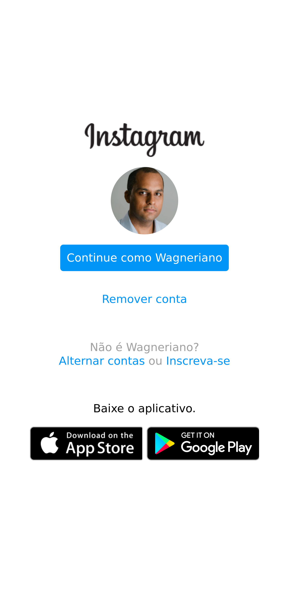
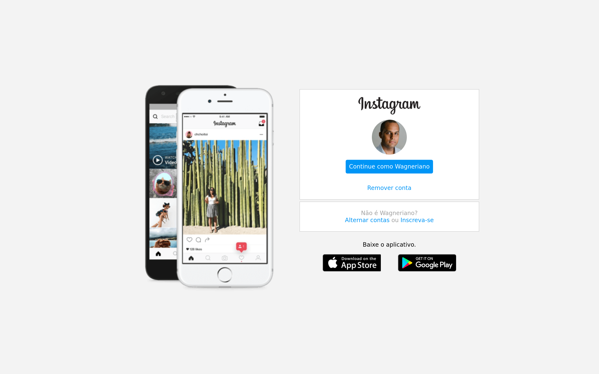

# DIO Instagram :rocket::metal: 
---

# Sobre o projeto:bulb::eyes: 
---
Desafio: Recriar a página inicial de login do Instagram.
O objetivo deste projeto é praticar o uso da propriedade CSS display com valor flex e responsividade.

## Layout mobile :triangular_ruler::mag: 
---

## Layout web :straight_ruler::mag: 
---

## Tecnologias utilizadas :wrench::dart: 
---
- HTML
- CSS  